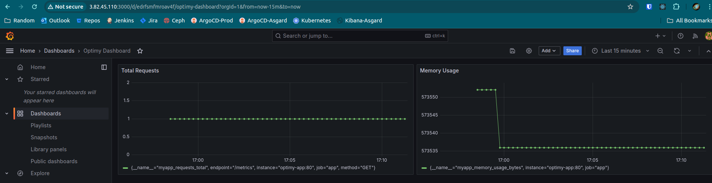
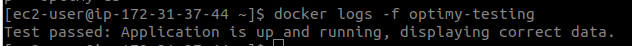
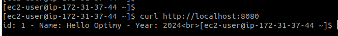
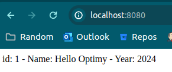

# Welcome to OptimyChallenge!

## Run the app locally:
1. Setup a .env file with the following parameters:
```MYSQL_ROOT_PASSWORD=
MYSQL_DATABASE=
DB_HOST=
DB_USER=
DB_PASS=
DB_NAME=
```
2. Run `docker compose up --build`

## Create ECR repos
```
aws ecr create-repository --repository-name optimy-app
aws ecr create-repository --repository-name optimy-db
aws ecr create-repository --repository-name optimy-testing
aws ecr create-repository --repository-name optimy-prometheus
aws ecr create-repository --repository-name optimy-grafana
```

## Deploy images
```
aws ecr get-login-password | docker login --username AWS --password-stdin <acc_id>.dkr.ecr.<region>.amazonaws.com
bash deploy_images.sh
```

## Deploy CloudFormation stack
```
aws cloudformation create-stack --stack-name optimy --template-body file://cloudformation.yaml --capabilities CAPABILITY_NAMED_IAM --parameters ParameterKey=<some_key>,ParameterValue=<some_value> .. 
```

## Printscreens



